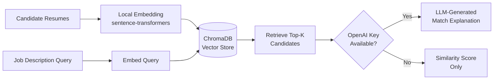
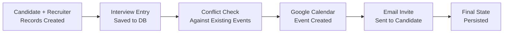

# 🤖 Agentic AI Recruitment Manager

**An AI-powered recruitment automation platform** — combining Retrieval-Augmented Generation (RAG) for intelligent candidate matching with agentic workflow orchestration for end-to-end interview scheduling, calendar sync, and email notifications.

[](https://agentic-ai-recruitment-manager.vercel.app/)
[](https://www.python.org/)
[](https://fastapi.tiangolo.com/)
[](https://www.trychroma.com/)

**🔗 Live Demo:** https://agentic-ai-recruitment-manager.vercel.app/

---

## 📌 What This Project Does

Recruitment teams waste hours manually screening resumes and coordinating interview logistics. This project automates both halves of that problem:

| Module | What it solves |
|---|---|
| 🔍 **RAG Candidate Matcher** | Semantically searches resumes against a job description — no keyword matching, actual meaning-based retrieval |
| 📅 **Interview Scheduling Engine** | Manages candidates, recruiters, interview slots, and availability end-to-end |
| 📧 **Notification Layer** | Auto-generates and sends personalized interview invites via email |
| 🗓️ **Calendar Integration** | Syncs scheduled interviews directly to Google Calendar with OAuth |

---

## 🏗️ Architecture

### RAG Candidate Matching Pipeline



### Interview Scheduling Workflow



---

## 🧰 Tech Stack

| Layer | Technology |
|---|---|
| **API Framework** | FastAPI (with auto-generated Swagger docs at `/docs`) |
| **Embeddings** | `sentence-transformers` (`all-MiniLM-L6-v2`) — runs fully local, no API key required |
| **Vector Database** | ChromaDB (persisted locally to `chroma_db/`) |
| **LLM (optional)** | OpenAI — generates natural-language match explanations |
| **Database** | SQLAlchemy + SQLite |
| **Calendar Integration** | Google Calendar API (OAuth 2.0) |
| **Notifications** | SMTP-based email service |
| **Deployment** | Vercel |

---

## ✨ Key Engineering Decisions

- **Local-first embeddings** — chose `sentence-transformers` over OpenAI embeddings so the system is fully self-contained and runs without any API costs or external dependency for its core retrieval function.
- **Graceful degradation** — if `OPENAI_API_KEY` isn't set, the system doesn't break; it simply returns similarity-ranked candidates without the LLM explanation layer.
- **Modular service architecture** — data layer, database layer, and service layer (calendar, email, RAG) are cleanly separated for maintainability and future extension.
- **Persisted vector index** — Chroma index survives restarts, so candidate embeddings don't need to be rebuilt on every run.

---

## 🚀 Quick Start

```bash
# 1. Clone and set up environment
git clone https://github.com/Vanshika290/Agentic_AI_Recruitment_Manager.git
cd Agentic_AI_Recruitment_Manager
python -m venv .venv
.venv\Scripts\activate        # Windows
pip install -r requirements.txt

# 2. Seed the database with sample data
python scripts/seed_data.py

# 3. Build the local vector index from candidate resumes
python scripts/build_vector_index.py

# 4. Run the API server
uvicorn app.api.rag_api:app --reload --port 8000
```

Then visit **`http://localhost:8000/docs`** for the interactive Swagger UI.

---

## 🔑 Environment Variables

| Variable | Required? | Purpose |
|---|---|---|
| `OPENAI_API_KEY` | Optional | Not required for candidate search or evidence-based explanations; retained for direct LLM explanation calls. |
| `OPENAI_MODEL` | Optional | Defaults to `gpt-4o-mini` for direct LLM explanation calls. |
| `DATABASE_URL` | Optional | SQLAlchemy connection URL. Defaults to the project's SQLite database file. Configure a persistent database path/storage for hosted deployments. |
| `JWT_SECRET_KEY` | Optional for the frontend | Used only by the retained legacy Google-auth and protected index-rebuild endpoints. |
| `GOOGLE_CLIENT_ID` | Optional for the frontend | Used only by the retained legacy Google-auth endpoint. |
| `GOOGLE_CREDENTIALS_JSON` / local `credentials.json` / `token.json` | Optional | Used only by Google Calendar integration. Never commit OAuth credentials or tokens. |

The name and profession form is a lightweight profile selector, not account authentication. Its values are kept in the browser's local storage.

---

## 👥 Frontend Workflows

Open `frontend/index.html`, enter a name, then choose a profession:

- **HR team** opens `frontend/dashboard.html`, where a job description is matched against indexed candidate resumes.
- **Student or job seeker** opens `frontend/student.html`, where a resume can be uploaded or pasted, compared with a target role and optional job description, and reviewed with an interactive career coach.

Resume analysis accepts PDF, DOCX, and TXT files up to 5 MB, or pasted text up to 30,000 characters. Files are parsed in memory and are not saved by the API. The ATS score is an estimate based on role keywords, common resume sections, and contact details; it does not predict a specific employer's ATS.

The career coach gives role-specific skill recommendations and resume-editing guidance. Its built-in guidance works without an OpenAI key.

---

## 📡 API Reference

- `GET /health` — checks that the API can reach its database.
- `POST /rag/search` — public candidate search; expects JSON with `query` (up to 15,000 characters) and optional `top_k` (1–20). It returns the indexed candidate count, ranked results, an estimated match score, recognized matched/missing skills, and the score breakdown. Scores use cosine-semantic similarity (70%) plus detected-skill coverage (30%) when the job description contains recognized skills; otherwise they use semantic similarity only. A missing skill means it was not found in the resume text, not that the candidate lacks it.
- `POST /student/analyze` — multipart form with `role` and either `resume` (PDF/DOCX/TXT) or `resume_text`; `job_description` is optional.
- `POST /student/coach` — multipart form with `role` and `question`; resume file/text and job description are optional context.
- `POST /rag/rebuild` — rebuilds the Chroma index from the SQL database; this retained administrative endpoint requires the legacy bearer-token authentication.
- `POST /auth/google` and `GET /auth/me` — retained legacy auth endpoints; the frontend does not use them.

---

## 🧪 Local Development

```bash
python -m pip install -r requirements.txt
uvicorn app.api.rag_api:app --reload --host 0.0.0.0 --port 8000
```

In a second terminal, serve the static frontend:

```bash
python -m http.server 5173 --directory frontend
```

Then open `http://localhost:5173/index.html`. For HR candidate search, seed the database and build its vector index using `python scripts/seed_data.py` and `python scripts/build_vector_index.py`.

The Vercel configuration publishes the static `frontend/` directory, so it does not run the FastAPI backend. The dashboard's deployed API URL is set in `frontend/api-config.js`. The Railway start command rebuilds the cosine-similarity Chroma index before starting FastAPI.

To deploy the API on Render:

1. In Render, create a new **Blueprint** from this GitHub repository and deploy the `render.yaml` service. It builds the resume index from the repository's SQLite database when the service starts.
2. After deployment, verify that `https://<your-render-service>.onrender.com/health` returns `{"status":"ok"}`.
3. In `frontend/api-config.js`, set `DEPLOYED_API_BASE` to the Render service's base URL (for example, `https://recruitment-manager-api.onrender.com`), then push the change and redeploy the Vercel frontend. Local development continues using `http://localhost:8000`. The API already allows the production Vercel origin in CORS.

Local development continues to use `http://localhost:8000` automatically. If the backend is not configured for a deployed frontend, the app now explains which configuration is missing instead of trying localhost.

---

## 📁 Project Structure

```
Agentic_AI_Recruitment_Manager/
├── app/
│   ├── api/
│   │   └── rag_api.py          # RAG search & rebuild endpoints
│   ├── database.py              # SQLAlchemy engine & session setup
│   ├── models/
│   │   └── models.py            # Candidate, Recruiter, Interview models
│   └── services/
│       ├── rag_service.py       # Embedding, retrieval, LLM explanation logic
│       ├── calendar_service.py  # Google Calendar OAuth + event creation
│       └── email_service.py     # Interview invite generation & SMTP send
├── scripts/
│   ├── seed_data.py             # Populate DB with sample candidates/recruiters
│   └── build_vector_index.py    # Build/rebuild the Chroma vector index
└── main.py
```

---

## 🛡️ Security Notes

- `chroma_db/`, `.env`, and `token.json` are excluded via `.gitignore` — no credentials or vector data are committed.
- Google OAuth tokens are never hardcoded or logged.
- The system is designed to run without exposing sensitive resume data to third-party APIs unless explicitly configured.

---

## 🔭 What's Next

- [ ] Hybrid search (dense + keyword/BM25) for improved retrieval precision
- [ ] RAGAS-based evaluation of retrieval quality (faithfulness, context precision)
- [ ] Migrate orchestration logic to LangGraph for stateful, multi-step agent workflows
- [ ] Dockerize for consistent deployment across environments

---

## 👩‍💻 Author

**Vanshika Saxena**
🔗 [GitHub](https://github.com/Vanshika290) · [LinkedIn](https://www.linkedin.com/in/vanshika-saxena-3447a8289/) · [LeetCode](https://leetcode.com/Vanshika_2907)
