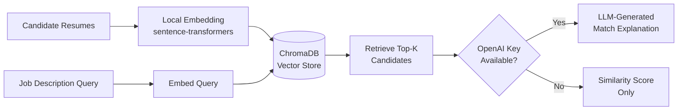
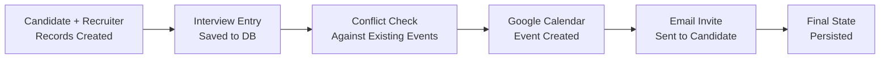

# 🤖 Agentic AI Recruitment Manager

**An AI-powered recruitment automation platform** — combining Retrieval-Augmented Generation (RAG) for intelligent candidate matching with agentic workflow orchestration for end-to-end interview scheduling, calendar sync, and email notifications.

[](https://agentic-ai-recruitment-manager.vercel.app/)
[](https://www.python.org/)
[](https://fastapi.tiangolo.com/)
[](https://www.trychroma.com/)

**🔗 Live Demo:** https://agentic-ai-recruitment-manager.vercel.app/

---

## 📌 What This Project Does

Recruitment teams waste hours manually screening resumes and coordinating interview logistics. This project automates both halves of that problem:

| Module | What it solves |
|---|---|
| 🔍 **RAG Candidate Matcher** | Semantically searches resumes against a job description — no keyword matching, actual meaning-based retrieval |
| 📅 **Interview Scheduling Engine** | Manages candidates, recruiters, interview slots, and availability end-to-end |
| 📧 **Notification Layer** | Auto-generates and sends personalized interview invites via email |
| 🗓️ **Calendar Integration** | Syncs scheduled interviews directly to Google Calendar with OAuth |

---

## 🏗️ Architecture

### RAG Candidate Matching Pipeline



### Interview Scheduling Workflow



---

## 🧰 Tech Stack

| Layer | Technology |
|---|---|
| **API Framework** | FastAPI (with auto-generated Swagger docs at `/docs`) |
| **Embeddings** | `sentence-transformers` (`all-MiniLM-L6-v2`) — runs fully local, no API key required |
| **Vector Database** | ChromaDB (persisted locally to `chroma_db/`) |
| **LLM (optional)** | OpenAI — generates natural-language match explanations |
| **Database** | SQLAlchemy + SQLite |
| **Calendar Integration** | Google Calendar API (OAuth 2.0) |
| **Notifications** | SMTP-based email service |
| **Deployment** | Vercel |

---

## ✨ Key Engineering Decisions

- **Local-first embeddings** — chose `sentence-transformers` over OpenAI embeddings so the system is fully self-contained and runs without any API costs or external dependency for its core retrieval function.
- **Graceful degradation** — if `OPENAI_API_KEY` isn't set, the system doesn't break; it simply returns similarity-ranked candidates without the LLM explanation layer.
- **Modular service architecture** — data layer, database layer, and service layer (calendar, email, RAG) are cleanly separated for maintainability and future extension.
- **Persisted vector index** — Chroma index survives restarts, so candidate embeddings don't need to be rebuilt on every run.

---

## 🚀 Quick Start

```bash
# 1. Clone and set up environment
git clone https://github.com/Vanshika290/Agentic_AI_Recruitment_Manager.git
cd Agentic_AI_Recruitment_Manager
python -m venv .venv
.venv\Scripts\activate        # Windows
pip install -r requirements.txt

# 2. Seed the database with sample data
python scripts/seed_data.py

# 3. Build the local vector index from candidate resumes
python scripts/build_vector_index.py

# 4. Run the API server
uvicorn app.api.rag_api:app --reload --port 8000
```

Then visit **`http://localhost:8000/docs`** for the interactive Swagger UI.

---

## 🔑 Environment Variables

| Variable | Required? | Purpose |
|---|---|---|
| `GOOGLE_CLIENT_ID` | Yes for Google sign-in | Public Google OAuth client ID used by the frontend and backend token verification |
| `JWT_SECRET_KEY` | Yes for auth | Secret used to sign application JWTs |
| `OPENAI_API_KEY` | Optional | Enables LLM-generated match explanations. Without it, similarity-only results are returned. |
| `OPENAI_MODEL` | Optional | Defaults to `gpt-3.5-turbo` |
| `GOOGLE_CREDENTIALS` / `token.json` | Optional | Required only for Google Calendar sync |

Example `.env` values:

```env
GOOGLE_CLIENT_ID=your-google-client-id.apps.googleusercontent.com
JWT_SECRET_KEY=replace-with-a-random-long-secret
OPENAI_API_KEY=your-openai-key-if-used
OPENAI_MODEL=gpt-3.5-turbo
```

> The Google OAuth flow only requires the public client ID on the frontend and in backend token validation. The Google client secret is not exposed to the browser and is not required for Google ID token verification.

---

## 🔐 Google Authentication Setup

### Backend auth endpoints

- `POST /auth/google` — validates the Google ID token, creates or reuses the user record, and issues a JWT.
- `GET /auth/me` — returns the authenticated user profile when a valid bearer token is supplied.

### Authenticated API protection

The RAG endpoints now require a valid bearer token:

- `POST /rag/search`
- `POST /rag/rebuild`

Requests without a valid token return `401 Unauthorized`.

### User model

The application now includes a `User` table with:

- `id`
- `google_id` (unique)
- `email` (unique)
- `name`
- `profile_picture`
- `created_at`
- `last_login`

This ensures the same Google account does not create duplicate user records.

---

## 🌐 Frontend login flow

The project includes a lightweight static frontend at `frontend/index.html` and `frontend/dashboard.html` for local Google sign-in testing.

- The login page displays the Google "Continue with Google" button.
- Google returns an ID token to the frontend.
- The frontend sends that credential to `POST /auth/google`.
- The backend verifies the token and returns a JWT.
- The frontend stores the token in local storage and redirects the user to the dashboard.

---

## 🧪 Local development

```bash
# 1. Create environment file
copy .env.example .env

# 2. Install dependencies
python -m pip install -r requirements.txt

# 3. Start the backend
uvicorn app.api.rag_api:app --reload --host 0.0.0.0 --port 8000

# 4. Serve the frontend locally
# From the repository root:
python -m http.server 5173 --directory frontend
```

Then open:

- Frontend: http://localhost:5173/index.html
- Backend: http://localhost:8000/docs

---

## ☁️ Google Cloud Console configuration

In Google Cloud Console, create or update an OAuth 2.0 Client ID for a web application.

### Authorized JavaScript origins

- `http://localhost:5173`
- `http://localhost:8000`
- `https://your-frontend-domain.vercel.app`

### Authorized redirect URIs

For the Google Identity Services popup flow used here, you typically do not need a custom redirect URL for the frontend page itself, but the OAuth client should include the exact application origins where Google Sign-In is loaded. For production, add:

- `https://your-frontend-domain.vercel.app`
- `https://your-backend-domain.onrender.com`

If you later switch to a redirect-based OAuth flow, add the exact callback route used by the frontend or backend.

---

## 🧾 Files changed for auth

- `app/config.py` — environment settings for Google client ID and JWT secret.
- `app/database.py` — base DB session setup and initialization.
- `app/models/models.py` — added `User` model.
- `app/services/auth_service.py` — Google token verification, user creation/reuse, JWT issuance, and authenticated-user dependency.
- `app/api/auth_api.py` — Google login and profile endpoints.
- `app/api/rag_api.py` — protected RAG routes.
- `frontend/index.html` — Google sign-in page.
- `frontend/dashboard.html` — authenticated dashboard landing page.
- `tests/test_google_auth.py` — verification tests for new user, existing user, invalid token, and protected endpoint behavior.

---

## ✅ Testing the Google login flow

1. Fill in `GOOGLE_CLIENT_ID` and `JWT_SECRET_KEY` in `.env`.
2. Start the backend at `http://localhost:8000`.
3. Open `http://localhost:5173/index.html`.
4. Click "Continue with Google" and choose an account.
5. Confirm the backend creates a new user if it is the first login.
6. Log in again to confirm the existing user is reused instead of duplicated.
7. Confirm the dashboard loads after successful auth.
8. Confirm a request without a valid token receives `401 Unauthorized`.

---

## 🛠️ Production deployment notes

When deploying to Vercel (frontend) and Render (backend):

- Set `GOOGLE_CLIENT_ID` in the backend environment.
- Use the same client ID on the frontend.
- Set `JWT_SECRET_KEY` to a strong random secret for each environment.
- Add your deployed frontend domain to the Google OAuth authorized JavaScript origins.
- Ensure the backend CORS configuration allows the frontend origin before launch.

---

## 📌 What was added

This implementation adds Google Authentication / Sign-in with Google without touching the recruitment scheduling or RAG logic beyond protecting the relevant authenticated endpoints.

---

## 📡 API Reference

### `POST /rag/search`
Search candidates semantically against a job description.

**Request:**
```json
{
  "query": "Python backend engineer with FastAPI experience",
  "top_k": 5
}
```

**Response:**
```json
{
  "query": "Python backend engineer with FastAPI experience",
  "results": [
    {
      "id": "cand_2",
      "metadata": { "name": "Jane Smith", "email": "jane@example.com", "id": 2 },
      "document": "Frontend developer with 5 years...",
      "distance": 1.5022,
      "explanation": null
    }
  ]
}
```
> `explanation` is `null` when `OPENAI_API_KEY` is not configured — the system still returns valid ranked results.

### `POST /rag/rebuild`
Rebuilds the Chroma vector index from the current SQL database.

**Response:**
```json
{ "status": "ok", "indexed": 12 }
```

---

## 📁 Project Structure

```
Agentic_AI_Recruitment_Manager/
├── app/
│   ├── api/
│   │   └── rag_api.py          # RAG search & rebuild endpoints
│   ├── database.py              # SQLAlchemy engine & session setup
│   ├── models/
│   │   └── models.py            # Candidate, Recruiter, Interview models
│   └── services/
│       ├── rag_service.py       # Embedding, retrieval, LLM explanation logic
│       ├── calendar_service.py  # Google Calendar OAuth + event creation
│       └── email_service.py     # Interview invite generation & SMTP send
├── scripts/
│   ├── seed_data.py             # Populate DB with sample candidates/recruiters
│   └── build_vector_index.py    # Build/rebuild the Chroma vector index
└── main.py
```

---

## 🛡️ Security Notes

- `chroma_db/`, `.env`, and `token.json` are excluded via `.gitignore` — no credentials or vector data are committed.
- Google OAuth tokens are never hardcoded or logged.
- The system is designed to run without exposing sensitive resume data to third-party APIs unless explicitly configured.

---

## 🔭 What's Next

- [ ] Hybrid search (dense + keyword/BM25) for improved retrieval precision
- [ ] RAGAS-based evaluation of retrieval quality (faithfulness, context precision)
- [ ] Migrate orchestration logic to LangGraph for stateful, multi-step agent workflows
- [ ] Dockerize for consistent deployment across environments

---

## 👩‍💻 Author

**Vanshika Saxena**
🔗 [GitHub](https://github.com/Vanshika290) · [LinkedIn](https://www.linkedin.com/in/vanshika-saxena-3447a8289/) · [LeetCode](https://leetcode.com/Vanshika_2907)
